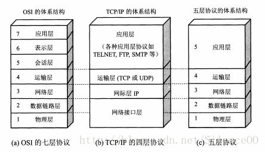
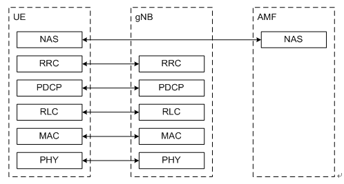
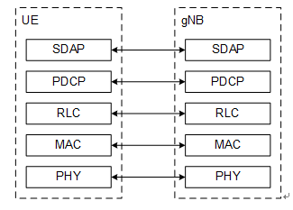
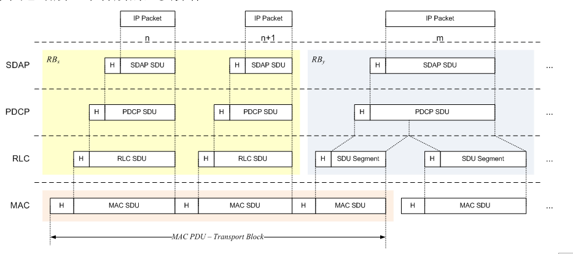
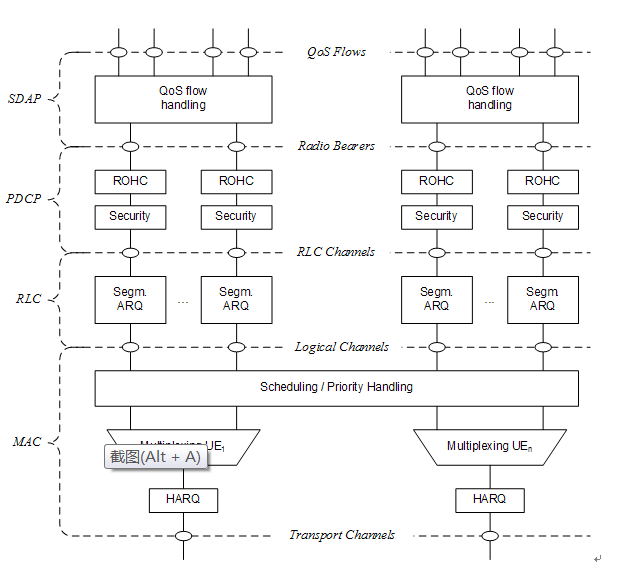

众所周知，在计算机网络中，OSI协议体系将网络分为七层。实际应用中，根据关注点的不同，又演变出不同的协议栈体系，不过协议的本质没区别。
<!--more-->

在有线网络中，数据链路层是以太网(Ethern)。在无线通信中，数据链路层是 LTE/NR 网络。

## 5G NR协议栈
NR无线协议栈分为两个平面：用户面和控制面。用户面(User Plane, UP）协议栈即用户数据传输采用的协议簇，控制面(Control Plane, CP)协议栈即系统的控制信令传输采用的协议簇。NR用户面和控制面协议栈稍有不同。

### 控制面
NR控制面协议几乎与LTE协议栈一模一样，从上到下依次为：
1. NAS层：Non-Access Stratum
2. RRC层：Radio Resource Control
3. PDCP层：Packet Data Convergence Protocol
4. RLC层：Radio Link Con trol
5. MAC层：Medium Access Control
6. PHY层：Physical

### 用户面
NR用户平面相比LTE协议栈多了一层SDAP层，用户面协议从上到下依次是：
1. SDAP层：Service Data Adaptation Protocol
2. PDCP层：Packet Data Convergence Protocol
3. RLC层：Radio Link Control
4. MAC层：Medium Access Control
5. PHY层：Physical

UE所有的协议栈都位于UE内；而在网络侧，NAS层不位于基站gNB上，而是在核心网的AMF （Access and Mobility Management Function）实体上。还有一点需要强调的是，控制面协议栈不包含SDAP层。

## NR 层2功能介绍
OSI协议体系中的数据链路层对应 NR 的层2，包含SDAP、PDCP、RLC和MAC层。整体结构如下：

其中每层具体工作是如下：

### MAC子层
MAC 层服务和功能的包括：
1. 逻辑信道与传输信道之间的映射
2. 复用、解复用。将来自一个或多个逻辑信道的MAC SDU复用到一个传输块并传递给PHY；将从物理层传来的传输块解复用成多个MAC SDU并传递给逻辑信道
3. 报告调度信息
4. 通过HARQ进行错误纠正（在载波聚合中，每个载波对应一个HARQ实体）
5. 通过动态调度管理用户间的优先级
6. 逻辑信道优先级管理
7. 填充

根据传输信息的类型来区分。MAC子层分为不同的逻辑信道。逻辑信道主要分为两类：控制信道和业务信道。
控制信道用于传输控制平面的信息，包括：
1. BroadcastControl Channel (BCCH)：用于广播系统控制信息的下行信道
2. BroadcastControl Channel (BCCH)：用于转发寻呼消息和系统信息变更的下行信道
3. CommonControl Channel (CCCH)：当UE与网络没有建立RRC Connection时，UE与网络间传输控制信息的信道
4. DedicatedControl Channel (DCCH)：当UE与网络已经建立RRC Connection时，UE与网络间传输控制信息的一对一信道

业务信道用于传输用户平面的信息，包含：
1. DedicatedTraffic Channel (DTCH)：一对一信道，指向一个UE，传输UE的业务数据，在上下行中都存在。

逻辑信道同物理信道有着映射关系：

| 下行  | 上行 |
| --- | --- |
| BCCH–> BCH | |
| BCCH–> DL-SCH | |  
| PCCH–> PCH    |  |
| CCCH–> DL-SCH | CCCH–> UL-SCH |
| DCCH–> DL-SCH | DTCH–> UL-SCH |
| DTCH–> DL-SCH | DCCH–> UL- SCH |  

### RLC子层
与LTE系统一样，NR RLC也包含三种传输模式：
1. TransparentMode (TM)
2. UnacknowledgedMode (UM)
3. AcknowledgedMode (AM)

每个逻辑信道对应一种RLC配置，RLC配置和ARQ都不依赖于物理层子载波间隔、CP类型和TTI长度等。
1. SRB0承载、寻呼和系统信息广播采用TM传输模式
2. 其他SRB承载采用AM传输模式
3. DRB承载可以采用AM或UM模式

RLC子层的服务和功能包括：
1. 传输上层的PDU
2. 编号（与PDCP层编码独立）（UM与AM模式）
3. 通过ARQ纠错（AM模式）
4. 对RLC SDU进行分割（UM与AM模式）和重分割（AM模式重传时）
5. 重组RLC SDU（UM与AM模式）
6. 重复检测（根据编号进行，AM模式）
7. RLCSDU丢弃（UM与AM模式）
8. RLC层重建
9. 协议错误检测（AM模式）

### PDCP子层
PDCP子层在用户面服务和功能包括：
1. 编号
2. 头压缩和解压缩（ROHC算法）
3. 传输用户数据
4. 重排序和重复检测
5. PDCP PDU路由（当存在Bear Split时）
6. PDCP SDU重传
7. 加密、解密和完整性保护
8. PDCP SDU丢弃
9. PDCP重建、为RLC AM恢复数据
10. PDCP PDU复制

PDCP子层在控制平面功能包括
1. 编号
2. 加密、解密和完整性保护
3. 传输控制面数据
4. 重排序和重复检测
5. PDCP PDU复制

### SDAP子层
每个PDU Session对应一个SDAP实体，和 IP 层的交互发生在这里，其功能包括：
1. QoS流与无线承载之间的映射
2. 在上下行数据包中标识QoS flow ID (QFI)