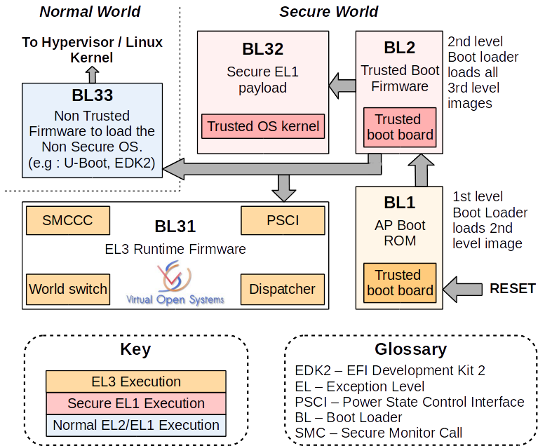

从上电的第一行代码到 init 进程启动
<!--more-->

本文主要描述在嵌入式 ARM V8 平台下的启动过程，x86 平台基本一致。cpu 上电之后就开始执行指令，在 init 进程启动之前，依次会经过 TF-A，uboot，linux 内核初始化三个阶段。在内核初始化的最后，需要挂载根文件系统。所以还需要一个根文件系统。

在 arm Neoverse N1 FVP 平台上，启动命令如下
```
./FVP_Base_Neoverse_N1x4 -C bp.secureflashloader.fname=bl1.bin -C bp.flashloader0.fname=fip.bin --data cluster0.cpu0=Image@0x80080000 \
--data cluster0.cpu0=devtree.dtb@0x84000000 --data cluster0.cpu0=ramdisk.img@0x88000000  -C bp.virtioblockdevice.image_path=vdisk.img " 
```
可以看到，总共需要tf-a固件 bl1.bin, fip.bin, 设备树文件devtree.dst，内核镜像 Image， 根文件系统 ramdisk，和一个选配的虚拟磁盘 vdisk.img.

## TF-A
uboot 作为 bootloader, 是可以在裸核环境下运行的。那么 TF-A （Trusted Firmware-A）是什么呢？ ARM 官方的定义是 TF-A 是一个安全监视器 （Secure Monitor）。ARM 为嵌入式设备提供了一套硬件安全机制，用以存放需要额外保护的信息，如指纹，证书等。为了驱动这套安全机制，ARM 提供的一个标准启动流程，这就是 TF-A。其主要的功能是从安全区域启动，对硬件做简单的初始化，引导 uboot 从非安全世界启动。这里不做过多的介绍，不需要它我们也可以直接从 uboot 启动。

TF-A 的文档和源码见https://trustedfirmware-a.readthedocs.io/en/latest/index.html。下载源码，编译即可。注意，tf-a 镜像需要将 uboot 镜像作为输入，一起编译。所以我们需要先编译uboot。tf-a的编译会生成 bl1.bin，fip.bin 镜像和 devtree.dst设备树文件。


## uboot
uboot的作用是引导操作系统内核启动。在 uboot 启动时，会设置一些基础的硬件，主要是搬运内核镜像，准备好传递给内核的启动参数，然后将控制权交给内核。

下载 [uboot](https://www.denx.de/wiki/U-Boot) 源码后，uboot针对fvp平台有默认的配置文件，运行 make vexpress_aemv8_semi_deconfig 编译 FVP 平台适用的 uboot。在 configs/vexpress_aemv8_semi_deconfig 文件中可以设置 cmdline 字符串给内核的一些启动参数。uboot在启动内核时，会将参数存在名为 bd 的结构体中，通过 X2 寄存器传递给内核。theKernel (0, machid, bd->bi_boot_params);

### uboot 的流程

uboot 从 arch/cpu/armv8/start.S 启动，大致操作是判断启动的 cpu id。对于 cpu0 执行初始化流程，其他 cpu 休眠等待 cpu0 的唤醒。cpu0 初始化向量表，初始化内存，然后打开命令行窗口等待命令。具体如下：

1. 启动后首先将自己的从 flash 搬运到链接地址，然后重新开始运行。由于我们通过 tf-a 直接将uboot加载到内存，实际上 uboot 已经在链接地址了。
2. 然后将初始化向量表，跳转到 _main
3. 在 _main 中跳转到 board_init_r，board_init_r 中调用一个初始化函数列表，依次调用各个初始化函数，最后进入 run_main_loop 进入 main 循环。

```asm
arch/cpu/armv8/start.S

pie_fixup:
	adr	x0, _start		/* x0 <- Runtime value of _start */
	ldr	x1, _TEXT_BASE		/* x1 <- Linked value of _start */
	sub	x9, x0, x1		/* x9 <- Run-vs-link offset */
	adr	x2, __rel_dyn_start	/* x2 <- Runtime &__rel_dyn_start */
	adr	x3, __rel_dyn_end	/* x3 <- Runtime &__rel_dyn_end */
	...
	bl reset_sctrl
	...
	adr	x0, vectors
	...
	
	branch_if_master x0, x1, master_cpu

slave_cpu:
	wfe
	ldr	x1, =CPU_RELEASE_ADDR
	ldr	x0, [x1]
	cbz	x0, slave_cpu
	br	x0			/* branch to the given address */
master_cpu:
	bl	_main

arch/cpu/lib/crt0_64.S
ENTRY(_main)
	...
	b	board_init_r			/* PC relative jump */
	/* NOTREACHED - board_init_r() does not return */
ENDPROC(_main)

common/board_init_r.c
init_sequence_r={
		...
		initr_console_record,
		cpu_init_r,
		initr_env,
		...
		run_main_loop,
}

void board_init_r(gd_t *new_gd, ulong dest_addr)
{
	
	if (initcall_run_list(init_sequence_r))
		hang();
	/* NOTREACHED - run_main_loop() does not return */
}
```
在 main 循环中， uboot 初始化了一个 cli 接口用于交互。至此 uboot 已经进入工作状态，可以通过输入 bootm/booti/boot 等命令，让uboot开始加载内核。
```
void main_loop(void)
{
	...
	cli_init();
	...
	cli_loop();
	panic("No CLI available");
}
```
在输入 bootm 命令之后，通过 cmd/bootm.c 中的 do_bootm 调用 common/bootm.c 中的 do_bootm_states 开始找到内核镜像，判断 OS 类型。将真正的启动函数存放在 boot_fn 指针中。 arm linux 对应的 boot_fn 函数是位于 arch/arm/lib/bootm.c 下的 do_bootm_linux(). 然后通过 boot_prep_linux 函数将命令行参数写入 gd->bd 。最后在 boot_prep_linux 中通过函数指针跳转之内核起始地址，以EL2的状态启动内核。

```
common/bootm.c

nt do_bootm_states(struct cmd_tbl *cmdtp, int flag, int argc,
		    char *const argv[], int states, bootm_headers_t *images,
		    int boot_progress)
{
	...
	ret = bootm_find_os(cmdtp, flag, argc, argv);
	...
	ret = bootm_load_os(images, 0);
	...
	boot_fn = bootm_os_get_boot_func(images->os.os);  //根据操作系统类型设置启动函数
	...	
	/* Now run the OS! We hope this doesn't return */
	
	ret = boot_selected_os(argc, argv, BOOTM_STATE_OS_GO,
				images, boot_fn);

	return ret;
}

arch/arm/lib/bootm.c 
nt do_bootm_linux(int flag, int argc, char *const argv[],
		   bootm_headers_t *images)
{
	boot_prep_linux(images);
	boot_jump_linux(images, flag);
	return 0;
}

static void boot_prep_linux(bootm_headers_t *images)
{
	char *commandline = env_get("bootargs");
	
	...
	setup_start_tag(gd->bd);
	...
	setup_serial_tag(&params);
	setup_commandline_tag(gd->bd, commandline);
	...
		
	setup_end_tag(gd->bd);
	}
}

static void boot_jump_linux(bootm_headers_t *images, int flag)
{
	...
	kernel_entry = (void (*)(void *fdt_addr, void *res0, void *res1,
				void *res2))images->ep;
	...
	armv8_switch_to_el2((u64)images->ft_addr, 0, 0, 0,
					    images->ep,
					    ES_TO_AARCH64);
	
}
```

## linux kernel
经过了漫长的流程，我们终于来到了linux内核。内核的编译也很简单，[下载](https://www.kernel.org/)源码之后, 设置环境变量 ARCH 为目标平台，这里我们设置为 arm64。make menuconfig 就会进入图形化配置界面。在配置中 board config中选择 vexpress-armv8-simulated 平台，make -j96 即可。注意：
1. 4.12内核默认没有打开PL011串口驱动，需要手动去 device -> character device 中启动。
2. CONFIG_BLK_DEV_RAM 的默认配置为 m，需要在 device ->block device 中改为y。否则，根文件系统挂载会失败。

内核入口在 EL2:0x80080000，入口位置在文件 arch/arm64/kernel/head.S 启动 。经过一些基础环境的准备，然后跳到 start_kernel()。具体流程如下:

1. 内核代码启动后，第一件事是从入口跳转到代码段.
2. 然后保存uboot传递过来的参数。在 [2] 处完成mmu页表配置。跳转到 __primary_switch。
3. 在 __primary_switch 中启动mmu。
<!-- 此后所有的地址都是虚拟地址。内核空间在高地址，用户空间在低地址。 -->
4. 然后在[4]，从 __primary_switch 跳转到 __primary_switched, 初始化异常向量表[5],设置 sp 栈指针[6], 至此，已经具备 c 函数执行的环境。
5. 接着清空 bss 段[7]。未初始化的全局变量和静态变量全部放在 bss 段中，清零 bss 段保证了它们的初始值是0.
6. 接下来，如果配置了地址随机，会将内核运行地址打乱，这样防止多次执行内核都在同一个地址，留下安全漏洞。
7. 最后，会跳转到 start_kernel 函数。

```asm
head.S
_head:
    b stext
    ...

ENTRY(stext)
	bl	preserve_boot_args   //[1]
	bl	el2_setup			
	adrp	x23, __PHYS_OFFSET
	and	x23, x23, MIN_KIMG_ALIGN - 1
	bl	set_cpu_boot_mode_flag 
	bl	__create_page_tables  //[2]
	bl	__cpu_setup		
	b	__primary_switch  
ENDPROC(stext)

__primary_switch:
    ...
	bl	__enable_mmu
    ...
	blr	x8    [4]

__primary_switched:
	...
	adr_l	x8, vectors			// [5]
	msr	vbar_el1, x8			
	isb
    msr	sp_el0, x5			// [6]
	... 
	adr_l	x0, __bss_start //[7]
	mov	x1, xzr
	adr_l	x2, __bss_stop

#ifdef CONFIG_RANDOMIZE_BASE
    bl	kaslr_early_init   //[8]
    ...
#endif
	...
	b	start_kernel

```

start_kernel 在 init/main.c 中，有一些列的初始化函数，包括体系结构相关初始化， 核心进程调度器和时钟中断初始化，串口初始化，创建虚拟文件系统等。这里列出两个比较关心的。setup_command_line()在较早调用，用来处理从 uboot 传递过来的参数。这些参数可能包括是否代开调试信息，early_printk使用的串口，根文件系统的位置等。

在初始化进行到一半过后，会初始化串口，接下来串口就会有输出，我们就可以调用 printk 从内核打印调试信息。这里就会有一个问题，内核初始化一开始就会有打印 ，但是直到初始化过半串口才就绪。这之前的打印怎么输出的呢。答案是，输出会存在内存的缓冲区里，等串口就绪之后才输出。如果通过uboot传递了early_con 参数，会采用传递过来的串口进行输出。然后等待正式串口就绪后替换掉 early_con.

在 start_kernel 的最后，调用了reset_init，进行剩下的初始化操作。 rest_init 中启动了2个内核进程，kernel_init 用来加载根文件系统，kthreadd 线程用来管理和调度其他线程和进程。最后会进入idel模式等待调度。
```
main.c
asmlinkage __visible void __init start_kernel(void)
{

	boot_cpu_init();
	page_address_init();
	pr_notice("%s", linux_banner);
	
    ...

	setup_command_line(command_line);

	...

	console_init();

    ...
	/* Do the rest non-__init'ed, we're now alive */
	rest_init();
}

reset_init()
{
    pid = kernel_thread(kernel_init, NULL, CLONE_FS);
    
	kthreadd_task = find_task_by_pid_ns(pid, &init_pid_ns);
	
	system_state = SYSTEM_SCHEDULING;

	complete(&kthreadd_done);

	/*
	 * The boot idle thread must execute schedule()
	 * at least once to get things moving:
	 */
	schedule_preempt_disabled();
	/* Call into cpu_idle with preempt disabled */
	cpu_startup_entry(CPUHP_ONLINE);
}
```

## 根文件系统的制作
在 kernel_init 中，会挂载完根文件系统。这个里涉及到根文件系统的制作和挂载。

下载 [busybox](https://busybox.net/) 然后编译 make menu 进行配置，一般采用默认配置即可。然后make -j96 即可。通过 make install PREFIX=/build/rootfs 将编译的文件拷贝到 rootfs目录下。接下来需要制作一个ramdisk镜像。

```
sudo dd if=/dev/zero of=ramdisk bs=1k count=16384
sudo mkfs.ext2 -F ramdisk

sudo mkdir -p ./initrd
sudo mount -t ext2 ramdisk ./initrd
sudo cp rootfs/* ./initrd -raf


sudo mknod initrd/dev/console c 5 1  //根文件系统中需要两个设备
sudo mknod initrd/dev/null c 1 3

sudo umount ./initrd
 
sudo gzip --best -c ramdisk > ramdisk.gz
sudo mkimage -n "ramdisk" -A arm -O linux -T ramdisk -C gzip -d ramdisk.gz ramdisk.img
```

在内核的 kernel_init 进程中，挂载完根文件系统，会尝试通过运行 execute_command 命令，该命令是内核参数 rdinit 指定，通过 uboot 传递进来。如果执行失败，会按照/sbin/init，/etc/init,,/bin/init, bin/sh 的顺序调用初始化进程完成启动。

```
init/main.c
static int __ref kernel_init(void *unused)
{
...
	system_state = SYSTEM_RUNNING;
	
	...

	if (ramdisk_execute_command) {
		ret = run_init_process(ramdisk_execute_command);
		if (!ret)
			return 0;
		pr_err("Failed to execute %s (error %d)\n",
		       ramdisk_execute_command, ret);
	}
	...
	if (execute_command) {
		ret = run_init_process(execute_command);
		if (!ret)
			return 0;
		panic("Requested init %s failed (error %d).",
		      execute_command, ret);
	}
	if (!try_to_run_init_process("/sbin/init") ||
	    !try_to_run_init_process("/etc/init") ||
	    !try_to_run_init_process("/bin/init") ||
	    !try_to_run_init_process("/bin/sh"))
		return 0;
```
至此，init 进程启动。内核启动完成，开始正常工作。