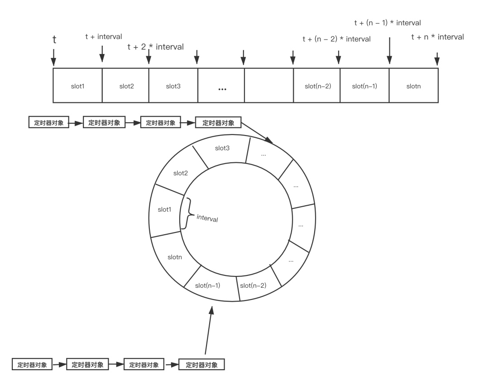

最近在服务器项目中加入了定时器。项目地址 [github](https://github.com/mequanwei/wServer)
<!--more-->
## 定时器的基本实现
定时器模块是服务器常用的功能之一，用于需要周期性的执行任务的场景。定时器的基本实现原理和逻辑并不复杂，核心关键点是如何设计出高效的定时器对象集合数据结构，使每次的从定时器集合中增加、删除、修改和遍历定时器对象更高效。先来看一个最简单的定时器，
```c++
void Wserver::doCheck()
{
    while (m_bRunning)
    {
        sleep(3000)   
        
        //do something
    }
}
```
上述代码每3秒执行一次定时任务,当需要用到多个定时器是，可以定义一个定时器类，然后通过链表来管理。
```c++
typedef std::function<void()> TimerCallback;
class Timer
{
    Timer() ;
    ~Timer();

    void run()
    {
        callback();
    }

    bool isExpired()
    {
        ...
    }
    
private:
    //id标识
    int64_t         m_id;
    //定时器的到期时间
    time_t          m_expiredTime;
    //触发的次数
    int32_t         m_repeatedTimes;
    //触发后的回调函数
    TimerCallback   m_callback;
};


std::list<Timer*> m_listTimers;

void wServer::doCheck()
{
    for (auto& timer : m_listTimers)
    {
        if (timer->isExpired())
        {
            timer->run();
        }
    }
}
```
对于定时器，除了简单的判断到期，还有增加定时器，删除定时器等操作，可以在类中实现对应方法。定时器一般支持单线程就够了，当时间触发时，向业务线程投递定时器消息即可。


## 性能优化

### 基于list/map
对于上述链表管理的定时器，每次我们检测定时器对象是否触发都要遍历定时器集合，移除定时器对象时也需要遍历定时器集合，其实我们可以将定时器按过期时间从小到大排序，这样我们检测定时器对象时，只要从最小的过期时间开始检测，一旦找到过期时间大于当前时间的定时器对象，后面的定时器对象就不需要再判断了。具体做法是在增加，删除或者到期触发后进行排序即可。
```c++
//TimerManager.h
struct TimerCompare  
{  
    bool operator() (const Timer* timer1, const Timer* timer2)  
    {  
        return timer1->getExpiredTime() <  timer2->getExpiredTime();
    }
}

void wServer::doCheck()
{
    //check and do callback

    m_listTimers.sort(TimerCompare());

}
```

有序链表的方式在移除一个定时器时仍需遍历，而且list的插入效率低，可以用 map 来替代 list 改进。


### 时间轮和时间堆
不过这样仍需要每次操作定时器之后重排，这里介绍两种高效的个定时器管理方法。时间片和时间轮。内核中通过时间轮来管理定时器。

先来介绍时间轮。时间轮的基本思想是将从现在时刻 t 加上一个时间间隔 interval，以 interval 为步长，将各个定时器对象的过期时间按步长分布在不同的时间槽（time slot）中，当一个时间槽中出现多个定时器对象时，这些定时器对象按加入槽中的顺序串成链表，时间轮的示意图如下：


因为每个时间槽的时间间隔是一定的，因此对时间轮中的定时器对象的检测会有两种方法：

第一种方法在每次检测时判断当前系统时间处于哪个时间槽中，比该槽序号小的槽中的所有定时器都已到期，执行对应的定时器函数之后，移除不需要重新触发的定时器，或重新计算需要下一次触发的定时器对象的时间并重新计算将其移到新的时间槽中。

第二种方法，即每次检测时假设当前的时间与之前相比跳动了一个时间轮的间隔。

时间轮的本质实际上将一个链表按时间分组，虽然提高了一些效率，但是效率上还是存在一个的问题，尤其是当某个时间槽对应的链表较长时。


再来说时间堆，所谓时间堆其实就是利用小根堆来组织定时器对象，根据到期时间的大小来组织。小根堆的各个节点代表一个定时器对象，它们按过期时间从小到大排列。使用小根堆在管理定时器对象和执行效率上都要优于前面方案中 list 和 map，boost和Libevent中定时器管理就是这样实现。